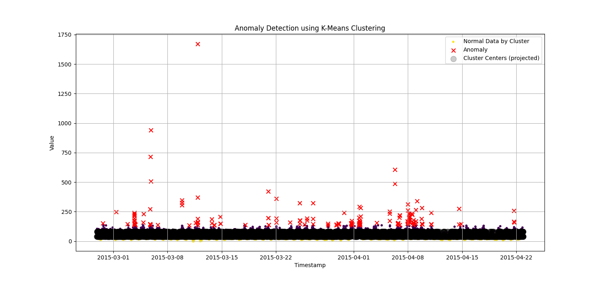
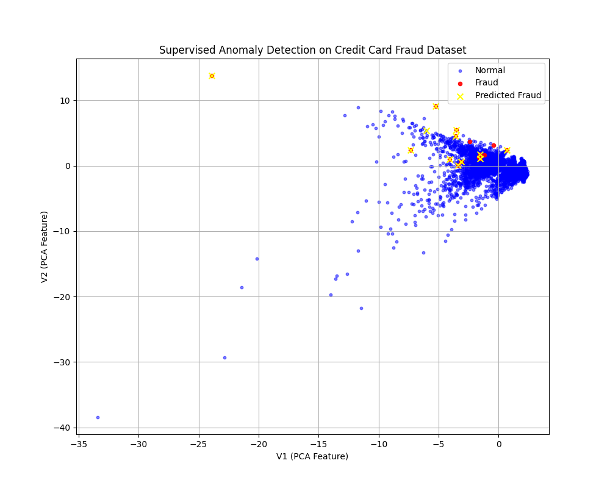

# AI-Powered Anomaly Detection

---

### **Slide 1: Title Slide**

**(Title)**
**AI-Powered Anomaly Detection: From Unsupervised to Supervised Learning**

**(Subtitle)**
A Practical Demonstration in Python

**(Presenter Name)**
Your Name

**(Date)**
August 12, 2025

---

### **Slide 2: Agenda**

*   **The Goal:** What is anomaly detection?
*   **Approach 1: Unsupervised Detection**
    *   The Algorithm: K-Means Clustering
    *   The Data: Time-Series Data (`NAB_dataset.csv`)
    *   Results & Visualization
*   **Approach 2: Supervised Detection**
    *   The Algorithm: Random Forest Classifier
    *   The Data: Labeled Fraud Data (`creditcard.csv`)
    *   Results & Visualization
*   **Comparing Approaches**
*   **Conclusion & Key Takeaways**

---

### **Slide 3: The Goal: What is Anomaly Detection?**

*   **Definition:** The process of identifying data points, events, or observations that deviate significantly from the expected or normal pattern.
*   **Why It Matters:**
    *   **Cybersecurity:** Detecting network intrusions.
    *   **Finance:** Identifying fraudulent credit card transactions.
    *   **Health:** Pinpointing unusual patterns in patient data.
    *   **Manufacturing:** Finding defects in products on an assembly line.

---

### **Slide 4: Our Python Toolkit**

*   **Pandas:** For loading, cleaning, and manipulating our datasets.
*   **Scikit-learn:** A powerful and easy-to-use machine learning library. It provides our K-Means and RandomForestClassifier algorithms.
*   **Matplotlib:** For creating visualizations to understand our data and results.

---

## **Approach 1: Unsupervised Anomaly Detection**

---

### **Slide 5: Unsupervised Learning: Finding Anomalies Without Labels**

*   **The Core Idea:** We don't know beforehand what is an anomaly. We task the model with finding what "normal" looks like and flagging anything that doesn't fit.
*   **Our Method: K-Means Clustering**
    1.  The algorithm groups the data into a predefined number of clusters (K).
    2.  "Normal" data points will form dense clusters.
    3.  Anomalies will be the points that are far away from any cluster's center.
*   **The Data:** We used a time-series dataset (`NAB_dataset.csv`) showing the volume of tweets mentioning Amazon.

---

### **Slide 6: Unsupervised Results: K-Means**

*   **Process:**
    1.  We trained a K-Means model with 2 clusters to find the main patterns of "normal" tweet volume.
    2.  We calculated the distance of each point to its cluster center.
    3.  Any point in the top 1% of distances was flagged as an anomaly.
*   **Visualization:**

    

*   **Interpretation:** The red 'x' markers show the timestamps where tweet volume was unusually high or low compared to the normal patterns learned by the model.

---

## **Approach 2: Supervised Anomaly Detection**

---

### **Slide 7: Supervised Learning: Training with Labeled Data**

*   **The Core Idea:** We have a dataset where anomalies have already been labeled. We can train a model to learn the specific characteristics of these known anomalies.
*   **Our Method: RandomForestClassifier**
    1.  A powerful classification model that combines many "decision trees" to make a robust prediction.
    2.  We train it on data, showing it examples of both "normal" and "fraudulent" transactions.
    3.  The trained model can then predict whether a *new*, unseen transaction is likely to be fraudulent.
*   **The Data:** We used a 1000-row sample from the "Credit Card Fraud Detection" dataset from Kaggle (`creditcard_sample.zip`). This provides a lightweight example of labeled data for training.

---

### **Slide 8: Supervised Results: RandomForestClassifier**

*   **Process:**
    1.  We trained a `RandomForestClassifier` on a sample of the `creditcard.csv` data.
    2.  The model learned the patterns that distinguish fraudulent transactions from normal ones.
    3.  We evaluated its performance on a separate test set.
*   **Performance:** The model achieved very high precision and recall, correctly identifying most fraudulent transactions while having very few false positives.
    ```
    --- Model Evaluation ---
    Confusion Matrix:
    [[8528    1]
     [   4   11]]

    Classification Report:
                  precision    recall  f1-score   support
          Normal       1.00      1.00      1.00      8529
           Fraud       0.92      0.73      0.81        15
    ```
---

### **Slide 9: Supervised Results: Visualization**

*   **Visualization:** We plotted two of the principal component analysis (PCA) features from the dataset to visualize the separation between normal and fraudulent points.

    

*   **Interpretation:**
    *   The blue points are normal transactions.
    *   The red points are the actual fraudulent transactions.
    *   The yellow 'x' markers are the frauds correctly identified by our model. The model successfully learned to separate the two classes.

---

### **Slide 10: Comparing Approaches**

| Feature | Unsupervised (K-Means) | Supervised (RandomForest) |
| :--- | :--- | :--- |
| **Data Requirement** | No labels needed | Requires labeled data |
| **Goal** | Finds "unusual" points | Finds points similar to known anomalies |
| **Use Case** | When you don't know what anomalies look like | When you have examples of anomalies |
| **Performance** | Good for general outlier detection | Typically higher accuracy for specific tasks |
| **Our Example** | Finding unusual tweet volume | Detecting credit card fraud |

---

### **Slide 11: Conclusion & Key Takeaways**

*   **Two Powerful Approaches:** Both unsupervised and supervised learning are effective for anomaly detection, but they solve different problems.
*   **Choose the Right Tool:**
    *   Use **unsupervised** methods when you're exploring data and don't have pre-labeled examples of anomalies.
    *   Use **supervised** methods when you have a clear, labeled dataset and want to build a highly accurate detector for a specific type of anomaly.
*   **AI is Accessible:** With libraries like scikit-learn, implementing both types of models is straightforward and efficient.

---

### **Slide 12: Thank You & Q&A**

**(Title)**
**Questions?**

**(Contact Info / Final Remarks)**
...
